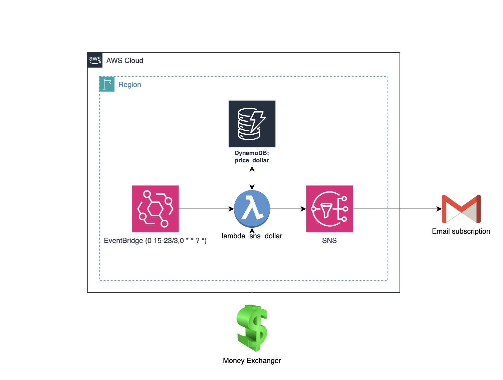

# Dollar Price tracker in Colombia

This project deploys a Lambda function that retrieves the dollar price from a local currency exchange, stores the data in DynamoDB, and sends notifications through SNS. It also includes infrastructure for logging, scheduling, and managing multiple deployment environments (Dev and Prod). The goal of this project is to demonstrate how AWS serverless services can be used to automate simple, personal tasks in a cost-effective manner.

Example of output:
```bash
{
  "message": "Lambda successfully run",
  "USD Price": "4070",
  "Previous Price": "4070",
  "TRM": "4,168.82",
  "timestamp": "2025-03-23T10:37:14.234936"
}
```

<table>
  <tr>
    <td></td>
    <td></td>
  </tr>
</table>

## Project Structure

The project is structured as follows:

-   `./terraform/`: Contains the Lambda function code and ZIP file.
    -   `lambda_function.py`: The Python code for the Lambda function.
    -   `lambda_function.zip`: The ZIP archive of the Lambda function code.
-   `README.md`: This file.
-   Terraform files: Define the AWS infrastructure.

## Resources and Layers

The project uses the following AWS resources:

###   IAM Roles and Policies

-   `aws_iam_role.lambda_execution_role`:  IAM role assumed by the Lambda function, granting it permissions to access other AWS services.
-   `aws_iam_policy.lambda_logs_policy`: IAM policy allowing the Lambda function to write logs to CloudWatch.
-   `aws_iam_role_policy_attachment.lambda_logs_policy_attachment`: Attaches the `lambda_logs_policy` to the `lambda_execution_role`.
-   `aws_iam_role_policy_attachment.lambda_SNS_execution_policy`: Attaches the AWS managed policy `AWSElasticBeanstalkRoleSNS` to the `lambda_execution_role` allowing the Lambda to publish to SNS topics.
-   `aws_iam_role_policy_attachment.lambda_CW_execution_policy`: Attaches the AWS managed policy `AWSLambdaBasicExecutionRole` to the `lambda_execution_role` allowing the Lambda to write to CloudWatch.
-   `aws_iam_policy.lambda_dynamodb_policy`: IAM policy allowing the Lambda function to interact with the DynamoDB table.
-   `aws_iam_role_policy_attachment.lambda_dynamodb_policy_attachment`: Attaches the `lambda_dynamodb_policy` to the `lambda_execution_role`.

###   Lambda Function and Related Resources

-   `aws_lambda_function.lambda_sns_dollar`: Defines the Lambda function.
    -   `handler`:  Specifies the entry point of the Lambda function (`lambda_function.lambda_handler`).
    -   `runtime`:  Specifies the Python runtime version (python3.9).
    -   `role`:  Specifies the IAM role for the Lambda function.
    -   `source_code_hash` and `filename`:  Used to deploy the Lambda function code from a ZIP file.
    -   `environment`: Defines environment variables for the Lambda function, including the URL to fetch dollar prices from and the SNS topic ARN.
    -   `reserved_concurrent_executions`: Sets the reserved concurrency for the lambda function.
    -   `publish`:  Indicates if a new version should be published on each deployment.
-   `aws_cloudwatch_log_group.lambda_log_group`:  Defines the CloudWatch Log Group for the Lambda function.
-   `aws_lambda_alias.dev_lambda_alias`: Defines a Lambda alias for the Development environment.
-   `aws_lambda_alias.prod_lambda_alias`: Defines a Lambda alias for the Production environment.
-   `aws_lambda_function_url.prod_alias_url`: Creates a function URL for the Prod alias.
-   `aws_lambda_function_url.dev_alias_url`: Creates a function URL for the Dev alias.

###   EventBridge

-   `module "eventbridge"`:  Uses the `./terraform/eventbridge.tf` module to create an EventBridge rule to trigger the Lambda function on a schedule.
-   `aws_lambda_permission.eventbridge_resource_based_policy_permission`: Grants EventBridge permission to invoke the Lambda function.

###   SNS Topic and Subscription

-   `aws_sns_topic.lambda_dollar_notifications`: Defines the SNS topic for sending notifications.
-   `aws_sns_topic_policy.lambda_dollar_notifications_policy`:  Defines the SNS topic policy to allow the Lambda function to publish messages.
-   `aws_sns_topic_subscription.email_subscription`: Defines an SNS subscription to send notifications to an email address.
-   `aws_lambda_function_event_invoke_config.lambda_sns_destination`: Configures the Lambda function to send failure notifications to the SNS topic.

###   DynamoDB Table

-   `aws_dynamodb_table.price_dollar`: Defines the DynamoDB table to store dollar price data.
-   `aws_iam_policy.lambda_dynamodb_policy`: Defines permissions for the Lambda function to access the DynamoDB table.

## Important Parts of the Code

###   Lambda Function Deployment

-   The Lambda function code is packaged into a ZIP file (`lambda_function.zip`) and deployed using the `source_code_hash` and `filename` attributes of the `aws_lambda_function` resource.
-   The Lambda function's entry point is specified by the `handler` attribute (`./terraform/lambda_function.lambda_handler`).

###   Environment Variables

-   The Lambda function uses environment variables to configure its behavior, including:
    -   `url`: The URL to fetch dollar price data.
    -   `sns_arn`: The ARN of the SNS topic to send notifications to.

###   Lambda Aliases

-   Lambda aliases (`dev_lambda_alias` and `prod_lambda_alias`) are used to manage different versions of the Lambda function for development and production environments. This allows for safer deployments and easier management.
-   Function URLs are created for both aliases, allowing for direct invocation via HTTP requests.

###   EventBridge Scheduling

-   The `eventbridge` module is used to schedule the Lambda function to run periodically using a cron expression.
-   The `aws_lambda_permission` resource grants EventBridge permission to invoke the Lambda function.

###   SNS Notifications

-   The Lambda function publishes notifications to an SNS topic (`lambda_dollar_notifications`).
-   An SNS subscription (`email_subscription`) is created to send notifications to a specified email address.
-   The `aws_lambda_function_event_invoke_config` resource can be used to send notifications upon function failure (or success).

###   DynamoDB Integration

-   The Lambda function interacts with a DynamoDB table (`price_dollar`) to store and retrieve dollar price data.
-   IAM policies are used to grant the Lambda function the necessary permissions to access the DynamoDB table.

## Usage

###   Prerequisites

-   AWS CLI configured with appropriate credentials.
-   Terraform installed.

###   Deployment

1.  **Access ./terraform:**
    ```bash
    cd ./terraform
    ```
2.  **Package Lambda Function:**
    ```bash
    cd ./terraform
    zip lambda_function.zip lambda_function.py
    ```
3.  **Initialize Terraform:**
    ```bash
    terraform init
    ```
4.  **Plan Terraform Deployment:**
    ```bash
    terraform plan
    ```
5.  **Apply Terraform Deployment:**
    ```bash
    terraform apply
    ```

###   Triggering the Lambda Function Asynchronously

You can trigger the Lambda function asynchronously using the AWS CLI:

```bash
aws lambda invoke --function-name lambda_sns_dollar --invocation-type Event response.json
```
